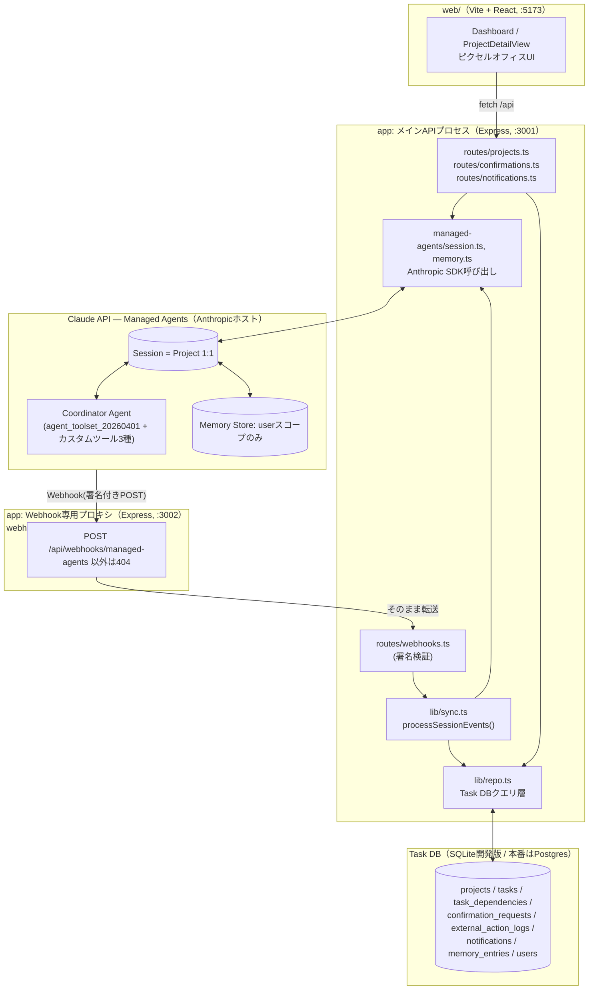
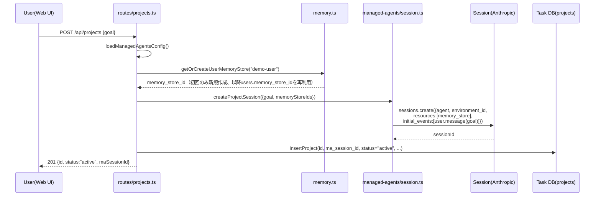
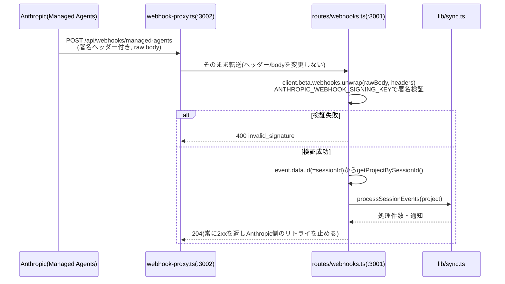
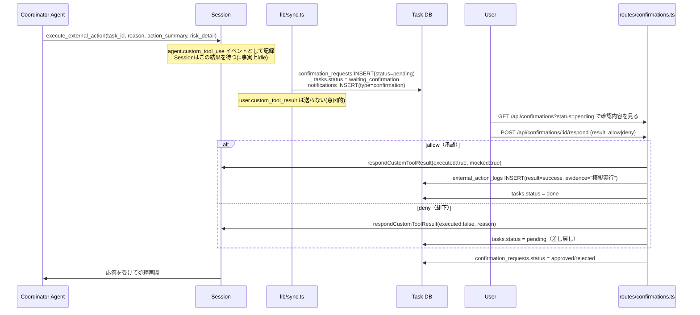

# AI Cowork 動作機序設計書

## 0. 本書の位置づけ

[technical-design.md](technical-design.md) が「要求(R-x/NG-x)をどう満たすか」という**目標設計**を定めた文書であるのに対し、本書は現在の実装（Phase 1〜2、実機接続確認済み。`app/`, `web/`）が**実際にどう動くか**を、コンポーネント間のイベント・データの流れに沿って記述する。

- 対象読者：実装を引き継ぐ／レビューする開発者。「どのファイルの何が、どの順番で呼ばれ、DBのどの行が変わるか」を追えることを目的とする。
- 技術設計書に対して実装が到達していない部分（ロースターAgent委譲、MCP接続、Scheduled Deployment等）は「未実装」として明示する（8章）。技術設計書の記述と食い違う場合は、動いているコードを正とする本書を優先する。

---

## 1. コンポーネントと実体プロセス



**実体プロセスは3つ**：
1. `app/src/server/index.ts`（:3001）— クライアント向けREST APIとWebhook受信を両方持つメインプロセス
2. `app/src/server/webhook-proxy.ts`（:3002）— 外部公開する唯一の窓口。ngrok等で公開するのはこのポートだけにし、無認証のREST API（:3001）を直接インターネットに晒さないための分離
3. `web/`（Vite dev server、:5173）— フロントエンド。`/api` への呼び出しは:3001へプロキシ/直叩き

`Anthropic`列は自前サーバーではなく、Anthropicがホストする外部SaaS（Claude Managed Agents）。アプリ側はSDK（`@anthropic-ai/sdk`のBeta API）経由でのみやり取りし、Agentのループやツール実行サンドボックスの実体はここでは動かない。

---

## 2. 起動前提（一度だけ行うセットアップ）

アプリ起動のたびには実行されない、初期化専用の処理。

| コマンド | 実行ファイル | 内容 |
|---|---|---|
| `npm run db:init` | `src/db/init.ts` | `schema.sqlite.sql` を適用し、デモユーザー1件（`demo-user`）を作成 |
| `npm run agents:setup` | `src/managed-agents/setup.ts` | Environment（実行サンドボックスのテンプレート）とCoordinator Agent（モデル`claude-haiku-4-5`、システムプロンプト、ツール一式）を**1回だけ**作成し、`.managed-agents.json`にID保存 |

`agents:setup`をリクエストパス（サーバー起動やProject作成）で呼ぶと、Agent/Environmentが増殖するため厳禁（`config.ts`のコメント参照）。以降のコードは`.managed-agents.json`のIDを`loadManagedAgentsConfig()`で読み込むだけ。

`Coordinator Agent`に登録されているツールは3種類のみ（`setup.ts`）：
- `agent_toolset_20260401`（標準ツールセット：bash/read/write/edit/glob/grep/web_fetch/web_search）
- `create_task` / `update_task_status` / `execute_external_action`（自前カスタムツール、`customTools.ts`）

MCPサーバー（カレンダー・メール等）は未登録（8章）。

---

## 3. 処理フロー詳細

### 3.1 Project作成（ユーザーの新規依頼）



- Session作成に失敗（`ANTHROPIC_API_KEY`未設定・`agents:setup`未実行等）した場合は**Projectを作成せず**502 `managed_agents_unavailable`を返す。「作成できたことにして後で失敗が判明する」という偽装をしない（NG-A対策、`routes/projects.ts`）。
- この時点でCoordinator Agentの推論・ツール呼び出しはAnthropic側で非同期に開始される。APIサーバーはレスポンスを返して終わり、以降の進行は3.2以降のWebhook/Syncで検知する。

### 3.2 Coordinator Agentの自律実行とタスク登録

Session内でCoordinator Agentは以下を行う（システムプロンプト: `systemPrompt.ts`）：

1. `goal`をサブタスクへ分解し、`create_task`（custom tool）を呼んでTask DBに登録させる
2. 作業を開始したら`update_task_status(in_progress)`、完了したら`update_task_status(done)`を呼ぶ
3. 情報収集・比較・下書き作成等は`agent_toolset`ツールで自律実行する（確認不要）
4. 予約・購入・送信・解約・削除・申請など不可逆/高リスクな操作が必要になったら`execute_external_action`を呼ぶ

いずれのcustom tool呼び出しも、SessionのイベントログにはSDK上`agent.custom_tool_use`として記録されるだけで、**呼び出した時点ではTask DBは一切更新されない**。DBへの反映は必ず3.4のSync層を経由する（Session側とTask DB側が別プロセス・別ストアであるため）。

`create_task`/`update_task_status`は、Sync層が処理すると即座に`user.custom_tool_result`を返すため、Coordinator Agentから見れば通常のツール呼び出しと同様に完結する。一方`execute_external_action`は、**ユーザーが承認するまでSync層が意図的に応答を返さない**ため、Coordinator AgentにとってこのSessionは「ツールの結果待ちで止まっている」状態になる（3.5参照）。

### 3.3 Webhookの着信経路



- `server/index.ts`では、Webhookルートだけ`express.json()`より前に`express.raw()`でマウントしている。署名検証は生ボディでないと成立しないため、この順序を崩すとWebhook全体が壊れる。
- `webhook-proxy.ts`は`POST /api/webhooks/managed-agents`以外のパスを一切受け付けない（404）。無認証で公開してよいのはこの1エンドポイントだけ、という設計上の境界線をプロセス分離で強制している（他のREST API、たとえば`POST /api/confirmations/:id/respond`が誰でも叩ける状態でインターネットに露出することを防ぐ）。
- ローカル開発でWebhook未公開の間は、代わりに`npm run sync -- <session_id>`（`scripts/manual-sync.mjs`）で`processSessionEvents`を手動起動できる。

### 3.4 Sync層：SessionイベントをTask DBへ反映

`lib/sync.ts` の `processSessionEvents(project)` が本システムの中核。

```mermaid
flowchart TB
    Start([Webhook受信 or 手動sync]) --> List[listSessionEvents(sessionId)<br/>events.list を asc で全件取得]
    List --> Cursor[project.last_synced_event_id<br/>より後ろのイベントだけ抽出]
    Cursor --> Loop{イベント種別}

    Loop -->|agent.custom_tool_use| Custom[handleCustomToolUse]
    Loop -->|agent.tool_use / agent.mcp_tool_use<br/>evaluated_permission=ask| Log[console.warnのみ<br/>DB未反映(8章)]
    Loop -->|span.outcome_evaluation_end| Outcome{result}
    Loop -->|session.status_terminated| Term[通知: 'Sessionが終了しました']
    Loop -->|agent.message等| Ignore[無視<br/>実況を通知にしない R-4/NG-E]

    Outcome -->|satisfied| Done[updateProjectStatus completed<br/>+ 完了通知]
    Outcome -->|failed| Fail[通知: 完遂条件を満たせず]

    Custom --> CreateTask[create_task:<br/>tasks INSERT + task_dependencies INSERT<br/>→ respondCustomToolResult ですぐ応答]
    Custom --> UpdateStatus[update_task_status:<br/>tasks.status UPDATE<br/>→ respondCustomToolResult ですぐ応答]
    Custom --> ExecAction["execute_external_action:<br/>confirmation_requests INSERT(status=pending)<br/>tasks.status=waiting_confirmation<br/>通知(confirmation)生成<br/>→ 応答を返さず待機（3.5）"]

    Done --> Cursor2[last_synced_event_id 更新]
    Fail --> Cursor2
    Term --> Cursor2
    CreateTask --> Cursor2
    UpdateStatus --> Cursor2
    ExecAction --> Cursor2
    Ignore --> Cursor2
    Log --> Cursor2
    Cursor2 --> Notif[notifications テーブルへ一括INSERT]
```

冪等性の担保：`projects.last_synced_event_id`をカーソルとして保持し、同じWebhookが再送されても、あるいは手動syncを何度実行しても、未処理イベントだけが処理される。`execute_external_action`については、さらに`getConfirmationByEventId()`で重複INSERTを防いでいる（`sync.ts:handleCustomToolUse`）。

### 3.5 確認・承認フロー（不可逆操作）



**現状の重要な制約**：`execute_external_action`は自前のcustom toolであり、実際の外部連携（MCP経由のカレンダー登録・送信等）はまだ実装されていない。承認された場合でも実行される中身は「模擬実行」（`executed:true, mocked:true`をSessionへ返すだけ）であり、`external_action_logs.evidence`にもその旨を明記している。UI側でも「模擬」であることを利用者に誤認させない表示にする必要がある（8章、NG-A対策）。

`confirmation_requests.ma_tool_kind`カラムで`native`（agent_toolset/MCPの`permission_policy: always_ask`由来）と`custom`（自前ツール由来）を区別する分岐が実装済みだが、`native`側は現状発火しない（3.4の「DB未反映」参照、8章）。

### 3.6 追加メッセージ・割り込み

- `POST /api/projects/:id/messages` → `sendUserMessage()` → `user.message`イベントをSessionへ追加送信。既存の文脈を保ったまま会話を継続する（例：「15万円まで」）。
- `POST /api/projects/:id/interrupt` → `interruptSession()` → `user.interrupt`イベントを送信。Coordinator Agentは現在の処理を中断し、確定済みの条件を引き継いで再計画する想定（SC-05、システムプロンプトのNG-J該当箇所）。

### 3.7 ダッシュボード表示（状態の導出）

`GET /api/projects` は保存された`status`（DBカラム）をそのまま返すのではなく、Task一覧から**都度導出**した`state`を返す（`repo.deriveProjectState()`）：

```
tasks.length === 0                      → "hold"
いずれかのtaskが waiting_confirmation   → "waiting_confirmation"
いずれかのtaskが in_progress            → "progress"
すべてのtaskが done                     → "done"
それ以外                                 → "hold"
```

`nextAction`は「確認待ちのタスク」を優先し、なければ「進行中のタスク」のタイトルを表示する。Web UI（`Dashboard.tsx`）はこの`state`をピクセルオフィスの見た目（デスクの人の有無・吹き出しバッジ等）へマッピングする。

---

## 4. データモデルと状態遷移

### 4.1 テーブルとManaged Agents側実体の対応

| Task DBテーブル | 実体 | 反映経路 |
|---|---|---|
| `projects` | Session（1 Project = 1 Session） | 作成: `POST /api/projects`。状態更新: Sync層（`span.outcome_evaluation_end`） |
| `tasks` | Session内の`agent.custom_tool_use`（`create_task`/`update_task_status`） | Sync層のみが書き込む |
| `task_dependencies` | `create_task`の`depends_on_task_ids`引数 | Sync層（`create_task`処理時） |
| `confirmation_requests` | `agent.custom_tool_use`（`execute_external_action`） | Sync層が作成、`routes/confirmations.ts`が解決 |
| `external_action_logs` | 確認応答後の実行結果（現状は模擬実行のみ） | `routes/confirmations.ts`（承認時のみ） |
| `notifications` | Sync層が検知した状態変化 | Sync層のみが書き込む |
| `memory_entries` | Memory Store（実体はAnthropic側） | **未実装**：`memory.ts`は`users.memory_store_id`の作成のみ行い、個別エントリのTask DBへの複写は未実装（8章） |
| `users` | ローカルのユーザーレコード | `db:init`で`demo-user`固定作成。認証なし |

### 4.2 状態遷移

```
Task.status:   pending → in_progress → waiting_confirmation → done
                    ↑                         │
                    └─────── (deny時に差し戻し)┘
               ※ blocked は update_task_status の呼び出しでのみ遷移（依存未完了時）

ConfirmationRequest.status: pending → approved | rejected （以降不変）

Project.status: active → completed（Outcome satisfied時のみ）
                       → blocked / cancelled（現状の実装コードから遷移させる経路なし。将来実装）
```

---

## 5. セキュリティ境界の設計判断

- **REST API（:3001）は無認証**（Phase 1のシングルユーザー前提）。そのため外部公開してよいのはWebhook 1本だけであり、`webhook-proxy.ts`をプロセスごと分離して境界を明示している（3.3参照）。API本体をそのままngrok公開しないこと。
- **Webhookの署名検証**は`ANTHROPIC_WEBHOOK_SIGNING_KEY`を用いた`client.beta.webhooks.unwrap()`で行う。検証前のペイロードは一切信用しない（`routes/webhooks.ts`）。
- **NG-A対策（虚偽の完了報告の防止）**が複数箇所に埋め込まれている：
  - Session作成失敗時にProjectを作らず502を返す（3.1）
  - `execute_external_action`は承認が下りるまでSessionを待機させ、Coordinator Agent自身も「完了と伝えるな」と指示されている（システムプロンプト）
  - 模擬実行であることを`external_action_logs.evidence`とレスポンスの`mocked:true`に明記する（3.5）

---

## 6. コンポーネント⇔ソースファイル対応表

| コンポーネント | ファイル |
|---|---|
| Anthropic SDKクライアント初期化 | `app/src/managed-agents/client.ts` |
| Agent/Environment作成（一度きり） | `app/src/managed-agents/setup.ts` |
| Agent/EnvironmentID永続化 | `app/src/managed-agents/config.ts`（`.managed-agents.json`） |
| Coordinator Agentのシステムプロンプト | `app/src/managed-agents/systemPrompt.ts` |
| カスタムツール定義 | `app/src/managed-agents/customTools.ts` |
| Session操作（作成/メッセージ/割り込み/確認応答/イベント取得） | `app/src/managed-agents/session.ts` |
| Memory Store（userスコープ）作成 | `app/src/managed-agents/memory.ts` |
| Task DBクエリ層 | `app/src/lib/repo.ts` |
| Sync層（Session event → Task DB） | `app/src/lib/sync.ts` |
| REST API本体 | `app/src/server/index.ts`, `app/src/server/routes/*.ts` |
| Webhook専用公開プロキシ | `app/src/server/webhook-proxy.ts` |
| DBスキーマ（開発用SQLite） | `app/src/db/schema.sqlite.sql` |
| DBスキーマ（本番Postgres） | `db/schema.sql` |
| ダッシュボードUI | `web/src/components/Dashboard.tsx`, `StatusSprite.tsx` |
| Project詳細UI | `web/src/components/ProjectDetailView.tsx` |
| 確認/承認UI | `web/src/components/ConfirmationsPanel.tsx` |
| 通知UI | `web/src/components/NotificationBell.tsx` |
| フロントAPIクライアント | `web/src/api.ts` |

---

## 7. ローカル開発での運用手順（実行順）

1. `npm run db:init`（`app/`）— Task DB初期化（初回のみ）
2. `npm run agents:setup`（`app/`）— Coordinator Agent/Environment作成（初回のみ）
3. `npm run dev`（`app/`）— APIサーバー起動（:3001）
4. `npm run dev`（`web/`）— フロントエンド起動（:5173）
5. Webhookを試す場合のみ：`webhook-proxy.ts`を起動しngrok等で:3002を公開 → Anthropic Consoleにエンドポイント登録 → `ANTHROPIC_WEBHOOK_SIGNING_KEY`を`.env`へ設定
6. Webhook未設定のままSessionの進行を確認したい場合：`npm run sync -- <session_id>`で手動同期（`maSessionId`はProject作成レスポンスまたは`SELECT ma_session_id FROM projects`で確認）

---

## 8. 技術設計書からの既知の未到達点

`technical-design.md`が描く目標設計に対し、現在の実装が到達していない／変更されている箇所。

| 技術設計書の記述 | 実装の現状 |
|---|---|
| Coordinator Agent + ロースターAgent（`multiagent`委譲、2層構成） | Coordinator Agent単体のみ。`multiagent`構成・委譲は未実装 |
| MCPサーバー（カレンダー・メール・Drive等）を`mcp_servers`で接続 | 未接続。`execute_external_action`は模擬実行に留まる |
| `agent_toolset`/MCPツールの`permission_policy: always_ask`によるnative confirmation | Sync層で検知（ログ出力）のみ。`agent.tool_use`をどのTaskに紐付けるか未確定のためTask DB反映は未実装 |
| Vault（外部連携の認証情報管理） | MCP未接続のため未使用 |
| Scheduled Deployment（期限監視・定期タスクのcron起動） | 未実装。期限管理・遅延検知は現状Task DBの`due_date`カラムのみで、能動的なチェック処理はない |
| Memory Store：project scope、`evidence_type`のTask DB複写 | userスコープの作成のみ実装。project scope、`memory_entries`テーブルへの複写、記憶編集画面は未実装 |
| モデル：Opus 5を既定 | コスト優先で`claude-haiku-4-5`を既定に変更（`npm run agents:update-model`で切替可能） |
| 認証・複数ユーザー | 未実装。`demo-user`固定のシングルユーザー |
| 本番DB（Postgres） | スキーマ（`db/schema.sql`）のみ用意。アプリは開発用SQLiteで動作 |
| Push通知（FCM/APNs） | 未実装。通知はDBの`notifications`テーブルとポーリング取得のみ |

これらは「設計の誤り」ではなく、Phase 1〜2で意図的に後回しにした範囲（`app/README.md`「実装状況」節、`technical-design.md` 10章ロードマップのPhase 3以降に対応）。次フェーズで着手する際は、本章の対応行から着手すること。
