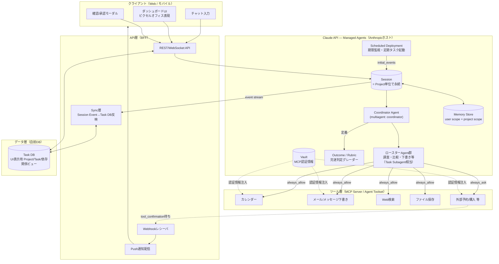
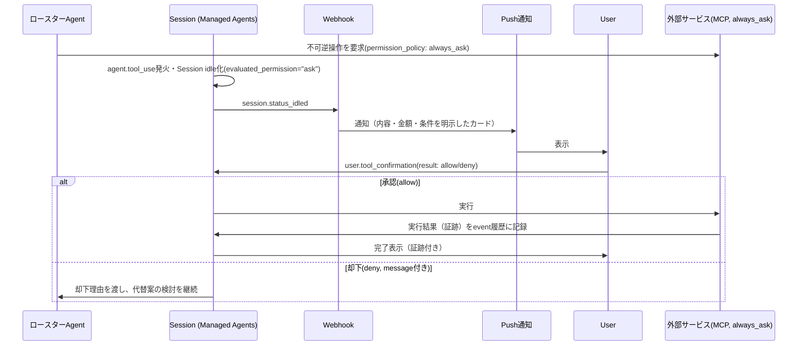

# AI Cowork 技術設計書

## 0. 本書の位置づけ

本書は、以下2つの文書に定義された要求を満たすシステムの技術設計を定める。

- 『AI Cowork システム要求定義（コンセプト版）』（以下「基本設計」） — R-1〜R-10 の機能要求、NG-1〜NG-5 の禁止挙動
- 『AI Cowork システム評価シナリオ定義書』（以下「テストシナリオ」） — SC-01〜SC-10 の評価シナリオ、E-01〜E-10 の評価項目、NG-A〜NG-J の重大NG

要求文書に対する本書の役割は「その要求をどう実現するか」であり、以降の章番号・記号（R-x、NG-x、SC-xx、E-xx）は元文書の記号をそのまま参照する。

**このセッションで確定した前提**

| 項目 | 決定内容 |
|---|---|
| インターフェース | 専用Web/モバイルアプリ（チャット欄は入力手段の一つとして併設。基本設計 NG-1「チャットだけで全てを管理しない」に対応） |
| AIオーケストレーション基盤 | Claude API — **Managed Agents**（Agent/Session/Memory Store/Outcome/Scheduled Deployment/Vault/Webhookをサーバー側でホストする仕組み）。詳細は4章・2章を参照 |
| ビジュアル言語 | ピクセルアート・オフィス（[2dPig「Pixel Office」](https://2dpig.itch.io/pixel-office)、CC0）を状態可視化（R-3）に採用。`assets/pixel-office/` に格納済み |

---

## 1. アーキテクチャ全体像



**設計判断の理由**

- **AIオーケストレーション基盤にClaude Managed Agentsを採用**したのは、Anthropicがエージェントループとツール実行サンドボックスをサーバー側でホストするため、独自に「Project Agentの永続化」「確認待ち状態の管理」「完遂判定」を一から実装する必要がなくなるため。基本設計R-1〜R-10の多くがManaged Agentsのネイティブ機能に1対1で対応する（下表）。
- **Coordinator Agent（multiagent: coordinator）とロースターAgent**の2層構成で、R-1（タスク中心管理）とR-7（目的を忘れない）を実現する。1つのProjectには1つの永続Sessionを対応させ、会話が終了してもSessionの状態（履歴・Memory Store参照）はAnthropic側に残り、後日の新規メッセージで文脈が失われない。
- **確認要否の判定はツール定義側の`permission_policy`で宣言的に強制**する。不可逆操作（予約確定・送信・購入・削除・申請）に紐づくMCPツール/カスタムツールにのみ`always_ask`を設定し、それ以外は`always_allow`（自律実行）とする。これにより、個々のロースターAgentの実装品質に依存せず、システムとして一律にNG-B（不可逆操作の無断実行）を防止できる。

| 要求定義の項目 | Managed Agentsの対応機能 |
|---|---|
| R-1 タスク中心管理／R-7 目的を忘れない | Session（Projectごとに1つ、永続） |
| R-2 自律的に進める／NG-B 無断実行防止 | ツールの`permission_policy: always_ask` + `user.tool_confirmation`イベント |
| R-4 状況変化のみ通知 | Webhooks（`session.status_idled`等の状態変化イベントのみ配信） |
| R-6 長期記憶 | Memory Store（永続・バージョン管理・監査ログ付き） |
| R-9 事実／推測の区別 | 独自スキーマ（`evidence_type`）をTask DB/Memory Store両方の記録規約として運用 |
| R-10 完遂責任 | Outcome（`user.define_outcome`のrubricを満たすまでグレーダーが自動でiterate） |
| SC-02/SC-07 定期タスク・期限監視 | Scheduled Deployment（cron起動、`initial_events`でSessionを都度生成） |

---

## 2. コンポーネント設計

### 2.1 Coordinator Agent（Managed Agents: multiagent coordinator）
- ユーザーの新規依頼（チャット/UI操作）を受け取り、既存Projectへの追加（既存Sessionへの`user.message`）か新規Project作成（新規Session作成）かを判定する。
- 判定基準：意味的な目的の一致度（既存Sessionのゴール記述とのマッチング）。曖昧な場合はSession側で確認事項として扱う（SC-08 曖昧な大規模依頼）。
- `multiagent.agents`にロースターAgentを登録し、調査・比較・下書き作成等を委譲する（1階層のみ。Managed Agentsの仕様上、委譲の入れ子は不可）。

### 2.2 Project = Session
- Projectごとに1つのSessionを対応させる。Session自体がAnthropic側で永続化されるため、会話が終了してもProjectの状態（履歴、確認待ちイベント）は失われない（R-6, R-7, NG-F対策）。
- 起動トリガーは3種類：①ユーザーの新規メッセージ（`user.message`をSessionへ送信）、②Scheduled Deploymentによる定期チェック（期限監視・定期タスク）、③外部イベント（例：MCP経由でのメール受信検知）。
- Session内でTask木（後述3.1）に相当する構造をCoordinator Agentが管理し、判断可能な項目は仮定を置いて自律的に先へ進める（R-2）。UI表示用のTask木はSync層がSessionのevent streamから起こす（後述2.5）。

### 2.3 ロースターAgent（Task Subagent相当）
- 調査、比較、下書き作成などの「実行して結果を返せば終わる」単位の作業を担当する。Coordinator Agentから見ると「詳細を委譲して要約だけ受け取る」関係になる（Session Thread機能で会話が分離される）。
- 外部への不可逆操作（Ext）を直接呼び出す権限は持たせず、該当ツールは`permission_policy: always_ask`に設定する（2.4参照）。

### 2.4 確認要否の制御（ツールのpermission_policy）
- 独立コンポーネントを自前実装するのではなく、Agent Toolset / MCPツールごとの`permission_policy`で宣言的に制御する。該当する場合は`always_ask`が設定されたツールの呼び出し時にSessionが自動的に`idle`となり、`agent.tool_use`イベント（`evaluated_permission: "ask"`）が発火する。クライアントは`user.tool_confirmation`（`result: "allow" | "deny"`）で応答する。
- 判定基準の例（基本設計R-2 / テストシナリオ NG-B・E-04に対応）：

| 分類 | 該当例 | `permission_policy` |
|---|---|---|
| 不可逆 | 予約確定、購入、送信、解約、削除、申請提出 | `always_ask` |
| 高リスク | 高額決済、他者への一斉連絡 | `always_ask` |
| 価値判断依存 | 複数候補からの選定、予算配分 | `always_ask`（候補提示ツールとして実装） |
| その他 | 情報収集、比較、下書き作成、計算 | `always_allow`（自律実行） |

### 2.5 Task DB（自前DB・UI表示用ビュー）
- Project / Task / SubTask / 依存関係 / 期限 / 確認待ち事項を構造化して保持する（詳細は3章）。Managed AgentsのSession/Threadは会話とツール実行の実体を持つが、ダッシュボードが必要とする「Task木」「依存関係」「期限」の構造化ビューはUI表示専用に自前DBへ投影する。
- Sync層（2.9参照）がSessionのevent stream（Webhook or Polling）を購読し、Task DBへ反映する。

### 2.6 Memory Store（長期記憶）
- ユーザー基本情報（居住地・家族構成・選好等）はuserスコープ、Project固有の確定事実はprojectスコープのMemory Storeとして保持する（R-6）。Session作成時に`resources`として関連するMemory Storeを`read_write`でアタッチする。
- 相対的な日付表現（「昨日」「来月」等）は保存時に絶対日付へ変換する（SC-07 合格条件）。
- Memory Storeへの機密情報（認証情報等）の保存は禁止し、認証情報はVault（2.8参照）で管理する。

### 2.7 実行証跡（Memory Version + Outcome + 独自Event Log）
- 外部への不可逆操作は、`user.tool_confirmation`の承認記録とツール実行結果（成功/失敗、予約番号等）をSessionのevent履歴として保持する。加えて、UI側の「完了」表示の根拠とするため、Sync層がこれをTask DBの証跡テーブルへ複写する。
- 「完了」とUI表示できるのは証跡が記録された場合のみ（NG-A 虚偽の完了報告の防止）。

### 2.8 Vault（外部連携の認証情報）
- カレンダー・メール・Drive・Slack等のMCPサーバーへの認証情報（OAuth）はVaultに保存し、Session作成時に`vault_ids`でアタッチする。サンドボックス（ツール実行環境）には認証情報そのものは渡らず、Anthropic側のプロキシがリクエスト送出時に注入する設計のため、プロンプトインジェクション経由の漏洩リスクを構造的に抑えられる。

### 2.9 Scheduled Deployment + Sync層
- 期限監視（例：SC-02の退去通知期限逆算）、定期タスクの次回期限算出（SC-07）は、cronで動くScheduled Deploymentが担う。発火のたびに`initial_events`で該当Projectのチェック用Sessionを起動する。
- Sync層は、SessionのWebhook（`session.status_idled`等）を受け、状態変化があった場合のみTask DBを更新し通知を発火する（R-4, NG-E対策）。単純な定期ポーリングだけではユーザーに通知しない。

未実装の連携は、テストシナリオ2章の方針どおり「模擬実行」を許容するが、UI上は「模擬」「確認待ち」等、実際の完了と誤認させない表示に固定する（NG-A対策）。

---

## 3. データモデル

### 3.1 主要エンティティ

```
User
 └─ Project (1:N)
     ├─ goal: string                      -- 最終目的（例:「11月末までに引っ越し完了」）
     ├─ status: enum(active, blocked, completed, cancelled)
     ├─ deadline: date | null
     └─ Task (1:N, 自己参照で木構造)
         ├─ title, status(pending/in_progress/waiting_confirmation/blocked/done)
         ├─ depends_on: Task[]             -- 依存関係（SC-02の前後関係制御に必須）
         ├─ due_date, source(auto/user)
         └─ ConfirmationRequest (0:1)

MemoryEntry
 ├─ scope: user | project
 ├─ key, value
 ├─ evidence_type: confirmed_fact | official_info | inferred | unconfirmed   -- R-9対応
 └─ valid_until: date | null              -- 陳腐化した情報の再確認に利用

ConfirmationRequest
 ├─ task_id, reason(不可逆/高リスク/価値判断)
 ├─ proposed_action(内容の要約), risk_detail
 └─ status: pending | approved | rejected

ExternalActionLog
 ├─ confirmation_request_id
 ├─ executed_at, result(success/failure)
 └─ evidence(予約番号・送信ID等)

Notification
 ├─ project_id, type(発見/方針変更/問題/確認/完了)
 └─ triggered_by(diffの内容)
```

### 3.2 設計上のポイント

- 上記はTask DB（自前DB、UI表示用ビュー）のスキーマである。`MemoryEntry`は実体としてはManaged AgentsのMemory Storeに保持され、Task DB側には検索・表示用のメタデータ（`evidence_type`等）のみを複写する。`ConfirmationRequest`/`ExternalActionLog`も同様に、実体はSessionのevent履歴（`agent.tool_use`〜`user.tool_confirmation`〜実行結果）であり、Sync層（2.9）がTask DBへ投影する。
- `evidence_type` をMemoryEntryだけでなく、ロースターAgentが生成するあらゆる出力テキストの根拠にも付与する運用ルールとする。UIでは「確認済み」「公式情報で確認済み」「未確認」を視覚的に区別する（SC-03, R-9, E-10）。
- `depends_on` によりTaskは有向グラフとなり、Scheduled Deployment発火時のチェックはこれを使って「新居契約前に退去通知を出さない」（SC-02）のような前後関係を強制する。
- `ConfirmationRequest` はTaskに対して0:1。1つのTaskに対する確認は基本的に1回で完結させる設計とし、確認の細分化によるNG-C（確認の過剰化）を避ける。

---

## 4. 状態可視化UI設計（ピクセルオフィス）

### 4.1 コンセプト

R-3「作業状況を常に可視化すること」を、テキストのステータス表示に加えて**ピクセルアートのオフィスフロア**として表現する。1つのProjectを1つの「デスク（ブース）」に見立て、Task/Projectの状態をキャラクターの振る舞いで直感的に示す。

素材は `assets/pixel-office/`（2dPig, CC0）を使用。`LargePixelOffice.png` のオフィスフロア風背景から、デスクとキャラクターを状態ごとに切り出して利用する。

### 4.2 状態 → ビジュアルのマッピング

| Project/Taskの状態 | ビジュアル表現 | 使用スプライト |
|---|---|---|
| 進行中 | キャラクターがデスクでPCに向かっている | `desk_coder_char.png` 相当 |
| 完了 | デスクに人がおらず、チェックバッジを添える | `desk_plain.png` + ✓バッジ（CSS） |
| 確認待ち | キャラクターが席を立ちこちらを向く＋吹き出しバッジ | 立ちキャラ + `!`バッジ（CSS） |
| 保留 / 未着手 | 空席のデスク（照明が暗いトーン） | `desk_plain.png`（明度を落とす） |

テキストのステータス（「進行中」「確認待ち」等）は必ずピクセル表現と併記する。ビジュアルだけに状態判断を依存させない（アクセシビリティ、およびNG-Eのような「実況」との混同回避のため）。

### 4.3 画面構成

1. **ダッシュボード（オフィスフロア）**：Project一覧をデスクの並びとして表示。各デスクにProject名、進捗、次の処理、期限を軽量表示。
2. **Project詳細**：Task木、依存関係、完了/保留/確認待ちの内訳、直近の中間報告ログ（R-3の詳細版）。
3. **確認モーダル**：ConfirmationRequestの内容、リスク種別、承認/却下ボタン（SC-06のフローに対応）。
4. **通知一覧**：状態変化通知のみを時系列表示（NG-E対策としてノイズになる実況ログとは別枠）。
5. **記憶編集画面**：Memory Storeの内容をユーザーが閲覧・訂正できる画面（誤った長期記憶の混入を防ぐガードレール）。

ダッシュボードの概念モックアップを別途Artifactとして作成する（本章の実物イメージ）。

---

## 5. 通知設計（R-4, NG-D, NG-E）

通知は以下のいずれかに該当する場合のみ発火する。

- 重要な発見（例：期限遅延の検知）
- 方針変更（ユーザー起点／システム起点）
- 問題発生（外部情報が取得できない等）
- 確認事項（`agent.tool_use`で`always_ask`ツールが呼ばれ、Sessionが確認待ちになった）
- Task/Projectの完了

「調べています」「もう少しです」等、状態が変化していない実況は通知として扱わない。長時間処理中でも、ダッシュボードの状態フラグ（進行中→完了/確認待ち）自体はリアルタイムに反映し、ユーザーが能動的に見れば分かる状態を維持する（R-3とR-4の役割分担：UIは常時可視化、通知は変化時のみ）。

---

## 6. 確認・承認フロー（不可逆操作）



`always_allow`のツールはこのフローを経由せず即時実行される。実行前確認は1つの操作につき原則1回にまとめる（金額・日時・条件など判断に必要な情報を1枚のカードに集約）。これはSC-06の合格条件「実行前確認が1回で済む」に対応する。

---

## 7. 技術スタック（提案）

| レイヤ | 技術候補 | 備考 |
|---|---|---|
| クライアント | React Native（Web/モバイル共通コード）または Next.js + Expo | ダッシュボードはCanvas/DOMいずれでもピクセルアートの`image-rendering: pixelated`表現で対応可能 |
| API/BFF | Node.js + TypeScript | Anthropic公式SDK（TypeScript版）を利用しBFFと親和性を持たせる |
| AIオーケストレーション | Claude API — Managed Agents（Agent / Session / Memory Store / Outcome / Scheduled Deployment / Vault / Webhook） | Coordinator/ロースターAgentは`multiagent`構成、確認フローは`permission_policy`、完遂管理は`Outcome`、定期実行は`Scheduled Deployment`でそれぞれ実現。詳細は2章・4章 |
| モデル | Claude Opus 5（既定）。定型・軽量な調査サブタスクはSonnet 5への切り替えを検討 | ユーザー向け対話やAgentの主判断はOpus 5、ロースターAgentの単純作業はコスト最適化としてSonnet 5を検討 |
| Task DB | PostgreSQL | Task木・依存関係はテーブル+自己参照外部キーで表現。Managed AgentsのSession/Memory Storeを補完するUI表示用ビュー |
| 長期記憶 | Managed Agents Memory Store（user/projectスコープ） | 構造化属性（evidence_type等）は自前DB側のメタデータ、記憶本文はMemory Storeに保持するハイブリッド構成 |
| スケジューラ | Managed Agents Scheduled Deployment（cron） | 期限監視・定期タスクの次回算出、発火のたびに該当ProjectのSessionへ`initial_events`を送信 |
| Push通知 | FCM / APNs（Webhook受信をトリガーに配信） | モバイル前提。Web版はWeb Push |
| 外部連携 | MCP（Google Calendar / Gmail / Drive / Slack 等）をManaged AgentsのAgentへ`mcp_servers`として宣言 | 本セッションで利用しているコネクタと同種の構成を踏襲。認証情報はVaultで管理 |
| 認証 | OAuth2（Google等）+ セッション管理 | 外部連携ごとにユーザーの明示同意を取得し、Vaultへ格納 |

*上記は初期提案であり、実装フェーズで詳細比較・確定する。*

---

## 8. テストシナリオとのトレーサビリティ

MVPで優先する5シナリオ（テストシナリオ 9章）と、対応するコンポーネントの関係。

| シナリオ | 主な評価対象 | 対応コンポーネント |
|---|---|---|
| SC-01 家族旅行の計画 | 要件整理・自律調査・比較・確認最小化 | Session（Memory Storeの既知情報活用）、ロースターAgent（比較調査）、`always_ask`ツール（予約前確認） |
| SC-02 引っ越し準備 | 長期タスク・依存関係・期限管理 | Task DB（depends_on）、Scheduled Deployment（期限逆算・遅延検知） |
| SC-05 方針変更への対応 | 割り込み・再計画・中間成果再利用 | `user.interrupt`（旧処理の中止）、Memory Store（条件の保持） |
| SC-06 外部操作を伴う予約 | 実行前確認・安全性・状態表示 | `permission_policy: always_ask`、Session event履歴（証跡）、Webhook通知 |
| SC-10 複数タスクの競合 | 優先順位・並列処理・リソース管理 | Task DB（複数Project横断の期限比較）、ダッシュボード（並行状態表示） |

評価は、テストシナリオ8章の記録テンプレート・7章のスコア基準（各シナリオ24点以上、E-04/E-09/E-10各2点以上、重大NG 0件、全体平均26点以上）をそのまま合否判定に使う。

---

## 9. 非機能要件（初期メモ）

- **監査性**：`user.tool_confirmation`の承認記録とツール実行結果はSessionのevent履歴として不可変に保持され、NG-A（虚偽の完了報告）を技術的に検知できる。Memory Storeの変更もバージョン管理（Memory Version）され、監査・ロールバックが可能。
- **プライバシー**：Memory Storeには家族構成・行政手続き情報等の機微情報が入るため、アクセス制御を必須とする。認証情報等の機密情報はMemory Storeへ保存せずVaultで管理する。金融情報等への接続はSC-08の合格条件どおり、ユーザーの明示許可なしに行わない。
- **可用性**：長期タスク（R-6、数ヶ月〜数年）は、SessionとMemory Storeが基盤側で永続化されるため、クライアント/BFF側の再起動・障害からは独立して復元可能。Task DB（UI表示用ビュー）はSessionのevent履歴から再構築できる設計とする。

---

## 10. ロードマップ（初期案）

1. **Phase 0（本書）**：技術設計の合意
2. **Phase 1**：Managed AgentsのAgent/Environment/Session作成の基本ループ、Task DB(Sync層)とダッシュボードUIの雛形（SC-01を素朴な形で通す）
3. **Phase 2**：`permission_policy: always_ask`とWebhook連動の確認・通知フローの実装（SC-06）
4. **Phase 3**：依存関係・期限管理（Task DB）・Memory Store活用（SC-02, SC-07）、Scheduled Deploymentの導入
5. **Phase 4**：複数Project間の優先順位管理（SC-10）
6. **Phase 5**：Outcome（rubric）を用いた完遂判定の導入、MVP5シナリオの評価実施・スコアリング、以降SC-03/04/08/09へ拡大
